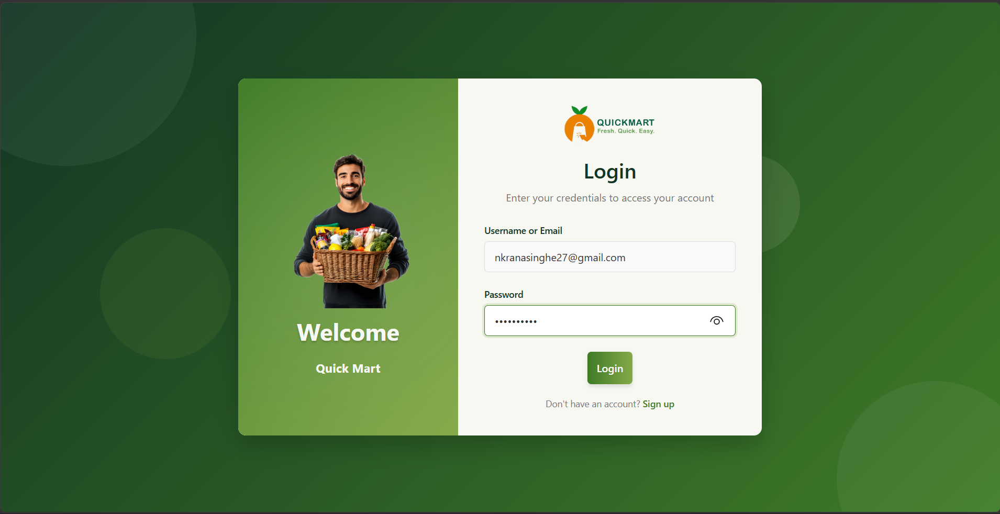
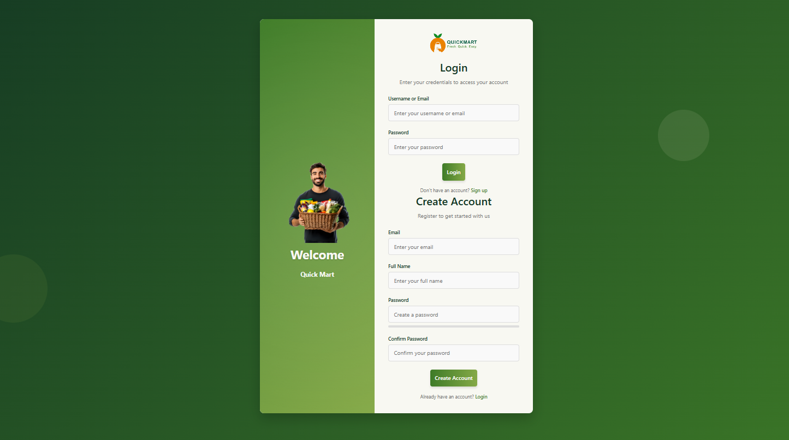
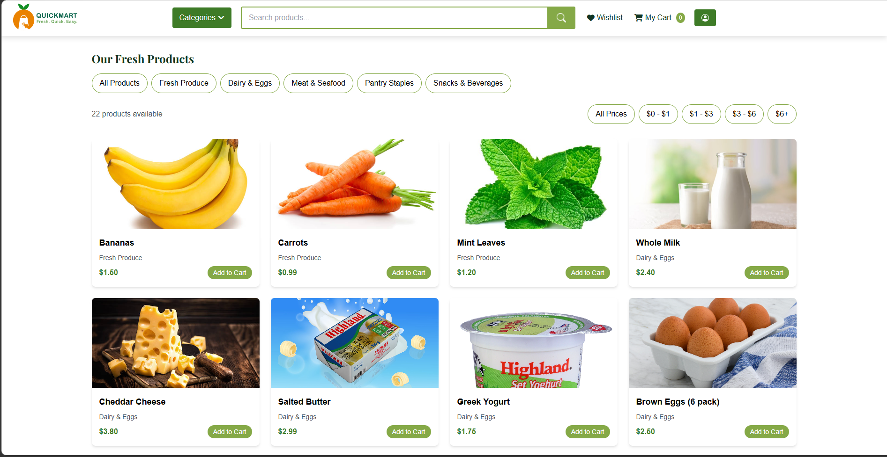
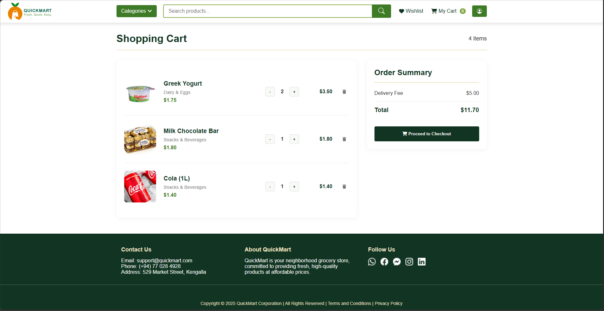
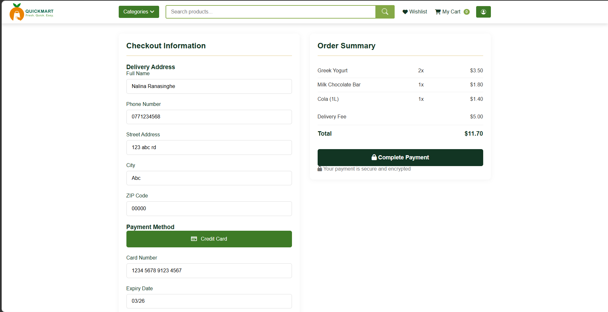
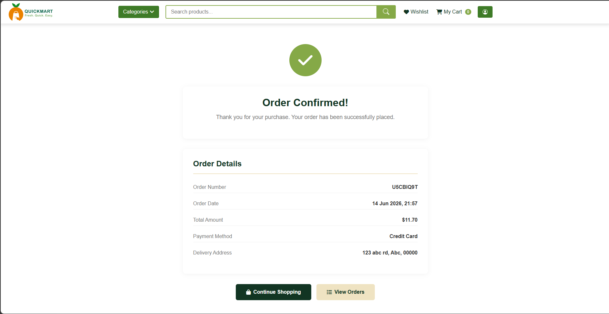
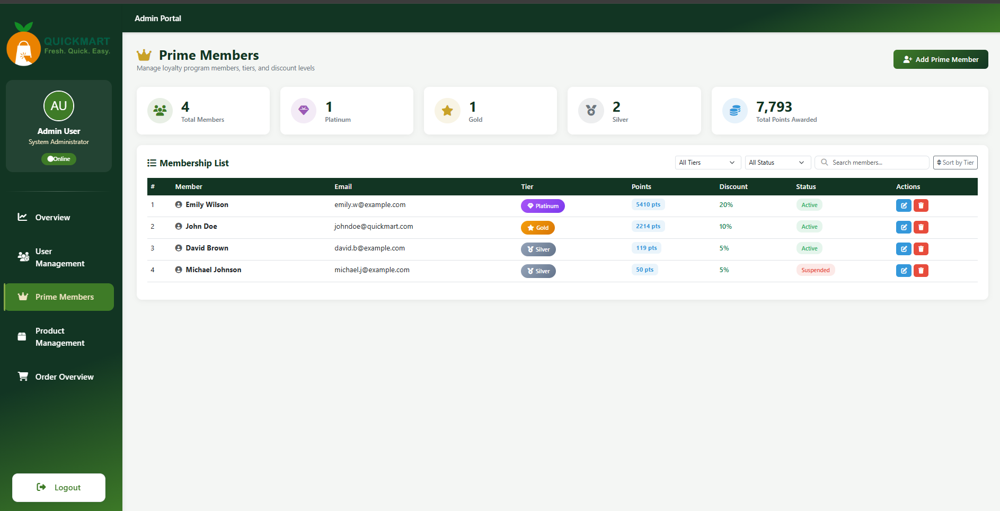
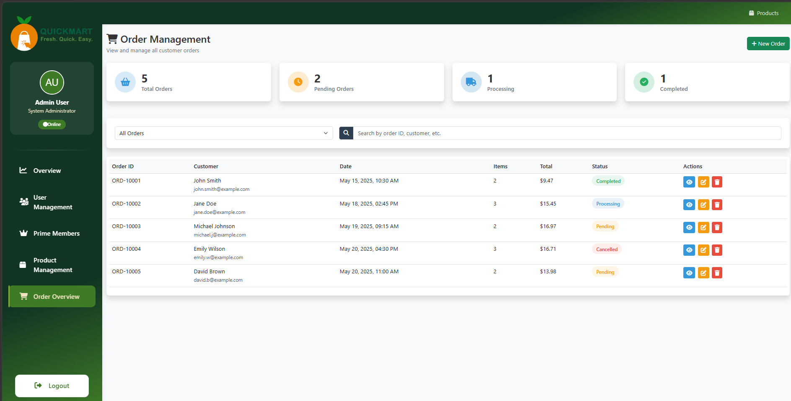

<p align="center">
  
</p>

# QuickMart Web Application

**QuickMart** is a robust e-commerce grocery store web application built using **Java Spring Boot**. Developed collaboratively as a university group project (Group 16) during our 1st year 2nd semester, this application demonstrates functional backend architecture, modular design, and a custom file-based persistence system. 

The project has been cleaned and made portfolio-ready to showcase our web development and team collaboration skills.

---

##  Key Features

###  Prime Membership (Loyalty Program)
I led the design and integration of the **Prime Membership (Loyalty member)** feature, enabling a centralized Loyalty Program management system within the Admin Dashboard.
*   **CRUD Operations**:
    *   **Create**: Add new loyalty members or upgrade existing users to loyalty status.
    *   **Read**: Centralized view of all loyalty members and their detailed profiles.
    *   **Update**: Modify member statuses, adjusting their discount tiers or points dynamically.
    *   **Delete**: Remove users from the loyalty member section securely.
*   **Advanced Controls**:
    *   **Search Engine**: Built-in functionality to query members instantly by Name or ID.
    *   **Sorting System**: Tier-wise sorting algorithm to organize members efficiently by their tier: **Silver, Gold, and Platinum**.

###  Shopping Cart & Checkout
*   Dynamic shopping cart supporting add, update (quantity adjustments), and remove operations.
*   Calculates real-time totals with delivery fee logic (Free delivery for orders $50+).
*   Session-scoped checkout process handling shipping and masked payment details.

###  User Authentication & Management
*   Custom session-based authentication system.
*   Distinct roles (Admin vs. User) with secure file-based storage.
*   Admin dashboard for system-wide user management.

###  Product Catalog
*   Browse products across various categories: *Fresh Produce, Dairy & Eggs, Meat & Seafood, Pantry Staples, Snacks & Beverages*.
*   Support for dynamic product image uploads.

---

##  Technology Stack

*   **Backend**: Java 17, Spring Boot 3.2.3, Spring Web
*   **Frontend**: Thymeleaf, HTML5, Vanilla CSS3, FontAwesome
*   **Persistence**: Custom File-based storage system (`users.txt`, `products.json`, `checkout_records/`)
*   **Build Tool**: Maven

---

##  Prerequisites

To run this project locally, you will need:
*   [Java Development Kit (JDK) 17](https://www.oracle.com/java/technologies/javase/jdk17-archive-downloads.html) or higher
*   A web browser to access the frontend application.
*   (Optional) Git to clone the repository.

---

## ⚙️ How to Run Locally

Follow these step-by-step instructions to get the application running on your local machine:

1.  **Clone the Repository**
    ```bash
    git clone https://github.com/<your-username>/QuickMart.git
    cd QuickMart
    ```

2.  **Build the Project**
    The project uses the Maven wrapper, so you don't need Maven pre-installed. Run the following command in the project root:
    *   **Windows**:
        ```cmd
        mvnw.cmd clean install -DskipTests
        ```
    *   **Mac/Linux**:
        ```bash
        ./mvnw clean install -DskipTests
        ```

3.  **Run the Application**
    Start the Spring Boot server:
    *   **Windows**:
        ```cmd
        mvnw.cmd spring-boot:run
        ```
    *   **Mac/Linux**:
        ```bash
        ./mvnw spring-boot:run
        ```

4.  **Access the Application**
    Once the server starts (you'll see `Started QuickMartApplication` in the terminal), open your web browser and navigate to:
    ```
    http://localhost:8080
    ```

---

## 👥 Team Contributions

This Online Grocery Order Management System was built collaboratively by our 6-member group in our 1st year 2nd semester for the module Object Oriented Programming (SE1020). As a sub-task, we implemented the **Queue algorithm** to process customer orders sequentially and the **Merge Sort algorithm** to sort products by category or price.

| Module | Assigned Member | Key Responsibilities |
| :--- | :--- | :--- |
| **Loyalty & Discounts (Leader)** | Nalina Ranasinghe | Managed Prime Membership module, Admin Dashboard integration, tier-based sorting, and CRUD for loyalty members. |
| **User Management** | Ramitha Bandara | Developed Login/Registration forms, User Dashboard, and CRUD for user accounts. |
| **Product Management** | Divyanjali Wickramarachchi | Displayed products, enabled product selection, and implemented CRUD for products. |
| **Cart Management** | Hamdhan Ahamed | Displayed selected items, managed quantity modifications/removals, and implemented CRUD for the cart. |
| **Order Processing** | Binuka Bandara | Viewed past & pending orders, allowed order updates, and implemented CRUD for orders. |
| **Payment & Checkout** | Samadhi Herath | Created payment form, order confirmation UI, and implemented CRUD for payments. |

---

##  Screenshots

Here are some screenshots from the application:

*   **Login & Registration**:
    
    
    
    

*   **Product Catalog**:
    
    

*   **Shopping Cart**:
    
    

*   **Checkout & Payment**:
    
    
    
    

*   **Admin Dashboard / Loyalty Program & Order Management**:
    
    
    
    

*Built with ❤️ by 2025_OOP_Group 16 for SE1020.*
